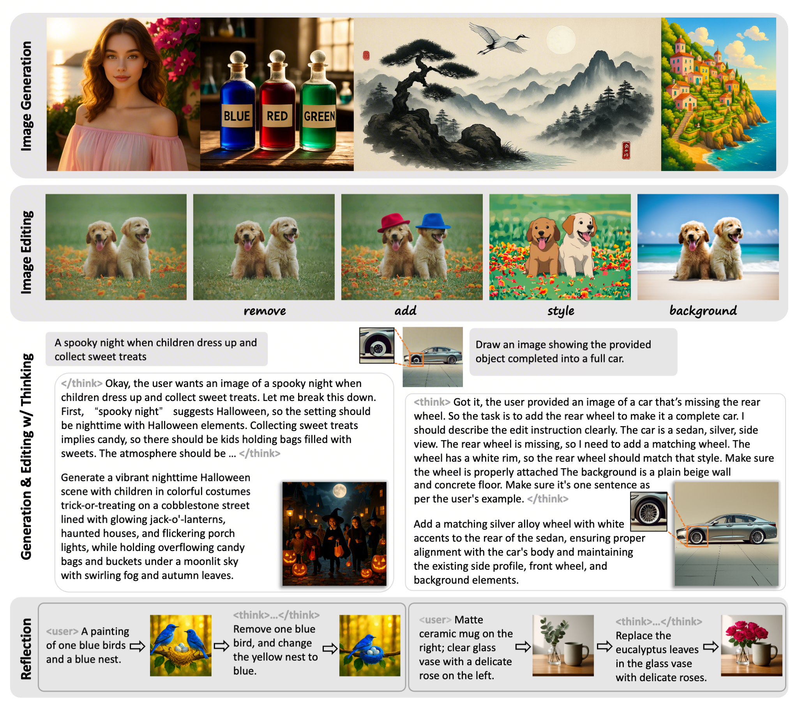

<div align="center">
<h1> ThinkGen: Generalized Thinking for Visual Generation</h1>
<h3></h3>

Siyu Jiao<sup>1</sup>, Yiheng Lin<sup>1</sup>, Yujie Zhong<sup>2</sup>, Qi She<sup>2</sup>, Wei Zhou<sup>2</sup>, Xiaohan Lan<sup>2</sup>   
Zilong Huang<sup>2</sup>, Fei Yu<sup>2</sup>, Yingchen Yu<sup>2</sup>, Yunqing Zhao<sup>2</sup>, Yao Zhao<sup>1</sup>, Yunchao Wei<sup>1</sup>

<sup>1</sup> Beijing Jiaotong University, <sup>2</sup> Bytedance


[](https://arxiv.org/abs/2512.23568)&nbsp;
[](https://huggingface.co/JSYuuu/ThinkGen)&nbsp;


</div>

<div align="center">

</div>


## 🚀 Quick Start

### 🛠️ Environment Setup

#### ✅ Recommended Setup

```bash
# 1. Clone the repo
git clone https://github.com/jiaosiyuu/ThinkGen.git
cd OmniGen2

# 2. (Optional) Create a clean Python environment
conda create -n thinkgen python=3.11
conda activate thinkgen

# 3. Install dependencies
# 3.1 Install PyTorch (choose correct CUDA version)
pip install torch==2.6.0 torchvision==0.21.0 torchaudio==2.6.0 --index-url https://download.pytorch.org/whl/cu124

# 3.2 Install other required packages
pip install -r req.txt

# ThinkGen runs even without flash-attn, though we recommend install it for best performance.
pip install  --no-cache-dir flash-attn==2.7.4.post1 --no-build-isolation
```

#### 🌏 For users in Mainland China

```bash
pip install torch==2.6.0 torchvision==0.21.0 torchaudio==2.6.0 --index-url https://mirror.sjtu.edu.cn/pytorch-wheels/cu124
pip install -r req.txt -i https://pypi.tuna.tsinghua.edu.cn/simple
pip install  --no-cache-dir flash-attn==2.7.4.post1 --no-build-isolation -i https://pypi.tuna.tsinghua.edu.cn/simple
```

---


* **Run Locally**:
```bash
from ThinkGen.model import ThinkGen_Chat
import os

chat_model = ThinkGen_Chat(
    model_path="JSYuuu/ThinkGen",
    dtype='bf16',
    height=1024,
    width=1024
)


## Gen
messages = [
    {"type": "text", "value": '''A young woman wearing a straw hat, standing in a golden wheat field.'''}
]
results = chat_model.generate_image(messages)
output_dir = "vis/chat"
os.makedirs(output_dir, exist_ok=True)

for i, img in enumerate(results.images):
    save_path = os.path.join(output_dir, f"result_{i}.png")
    img.save(save_path)
    print(f"Saved to {save_path}")


## Gen-Think
messages = [
    {"type": "text", "value": '''A young woman wearing a straw hat, standing in a golden wheat field.'''}
]
results = chat_model.generate_image(messages, think=True)
output_dir = "vis/chat"
os.makedirs(output_dir, exist_ok=True)

print(f"cot & rewrite prompt: \n{results.prompt_cot}")
for i, img in enumerate(results.images):
    save_path = os.path.join(output_dir, f"result_think_{i}.png")
    img.save(save_path)
    print(f"Saved to {save_path}")


## Und
messages = [
    {"type": "image", "value": "images/teaser.png"},
    {"type": "text", "value": "Describe this image"}
]

response = chat_model.generate_text(messages)
print(response)

```

## Acknowledgments
This work builds upon the following great open-source projects:
* **OmniGen2:** https://github.com/VectorSpaceLab/OmniGen2
* **Qwen3VL:** https://github.com/QwenLM/Qwen3-VL
* **EasyR1:** https://github.com/hiyouga/EasyR1
* **Flow-GRPO:** https://github.com/yifan123/flow_grpo
